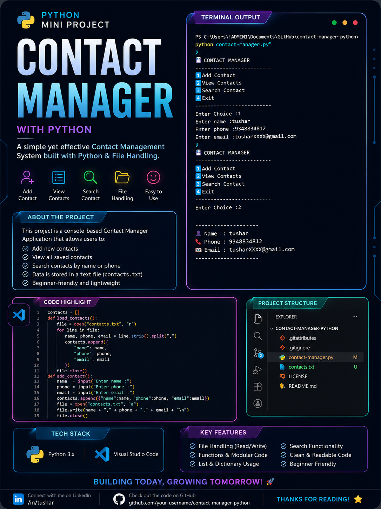

# 📇 Contact Manager

A simple **Contact Manager** built with **Python 🐍** that helps users efficiently manage their contacts through a menu-driven interface. The application supports adding, viewing, searching, updating, and deleting contacts with data stored in a local text file.

## ✨ Features

* ➕ Add new contacts
* 👀 View all saved contacts
* 🔍 Search contacts by name or phone number
* ✏️ Update existing contacts
* 🗑️ Delete contacts
* 💾 Save contacts to `contacts.txt`
* 📂 Automatically load contacts on startup
* 📜 View activity history (current session)
* 🖥️ Simple menu-driven interface

## 🛠️ Technologies Used

* 🐍 Python
* 📂 File Handling
* 📚 Lists
* 📖 Dictionaries
* 🔄 Loops
* ⚙️ Functions
* 🎯 Conditional Statements

## 🚀 How to Run

```bash
python contact_manager.py
```

## 📂 Project Structure

```text
Contact-Manager/
│── contact_manager.py
│── contacts.txt
│── screenshot1.png
└── README.md
```

## 📸 Screenshot



## 📚 What I Learned

* CRUD Operations (Create, Read, Update, Delete)
* Python File Handling
* Working with Lists & Dictionaries
* Building Menu-Driven Applications
* Writing Modular Code Using Functions

## 🔮 Future Improvements

* 🕒 Save history permanently to `history.txt`
* 📧 Update phone number and email separately
* ⭐ Mark favorite contacts
* 🔒 Password protection
* 🎨 GUI version using Tkinter

---

⭐ **If you found this project useful, consider giving it a star!**
